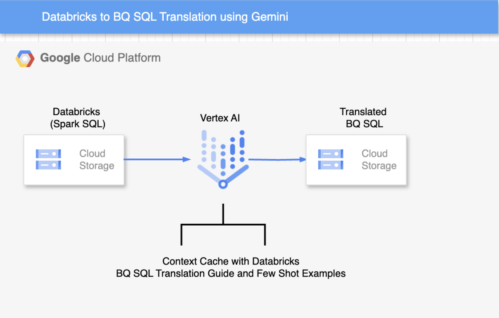

# Databricks to BigQuery SQL Translation Accelerator

This repository contains a Google Cloud Function that leverages Vertex AI's Generative Models with Retrieval Augmented Generation (RAG) to translate Databricks SQL queries into BigQuery SQL queries. The function reads SQL content from a specified Google Cloud Storage (GCS) path, performs the translation, and then uploads the translated BigQuery SQL to another GCS bucket.


## Features

- SQL Translation: Translates Databricks SQL syntax to BigQuery SQL syntax.

- RAG Integration: Utilizes a Vertex AI RAG Corpus for context-aware translation, improving accuracy and relevance.

- GCS Integration: Reads input SQL files from GCS and writes translated SQL files back to GCS.

- Automatic RAG Corpus Management: Automatically creates and populates a RAG Corpus with specified context files if it doesn't already exist.

- Cloud Function Deployment: Designed to be deployed as a Google Cloud Function triggered by HTTP requests.

- LLM Used : This translation will use gemini-2.0-flash-001 model for translation.

## Architecture Design




## Setup and Deployment

- Configure Project and Storage
Update the placeholder variables in your main.py file with your specific GCP project and GCS bucket details:


```python
PROJECT_ID = "your-gcp-project-id"
LOCATION = "us-central1"

# Display name of your RAG corpus
RAG_CORPUS_DISPLAY_NAME = "test_rag_corpus"

CONTEXT_FILES_GCS_PATHS = [
    "gs://your-rag-context-bucket/Databricks SQL to BigQuery SQL Migration.pdf",
    # Add more context files as needed
]
# Outputs GCS Bucket name
BQ_SQL_OUTPUT_BUCKET = "your-bq-sql-output-bucket"
```
    
- Create GCS Bucket
Make sure the GCS buckets specified in CONTEXT_FILES_GCS_PATHS and BQ_SQL_OUTPUT_BUCKET exist in your project. If not, create them using gsutil:

```bash
gsutil mb gs://your-rag-context-bucket
gsutil mb gs://your-bq-sql-output-bucket
```

- Upload Context Files
Upload the PDF document(s) you want to use for the RAG corpus to the GCS bucket specified in CONTEXT_FILES_GCS_PATHS.

```bash
gsutil cp "path/to/your/Databricks SQL to BigQuery SQL Migration.pdf" gs://your-rag-context-bucket/
```

- Deploy the Cloud Function

## Usage

Once the Cloud Function is deployed, you can invoke it with an HTTP POST request.

```bash
INPUT_SQL_GCS_PATH="gs://your-input-sql-bucket/my_databricks_query.sql" # Ensure this file exists in GCS

curl -X POST "$FUNCTION_URL" \
  -H "Content-Type: application/json" \
  -d '{
        "databricks_sql_gcs_path": "'"$INPUT_SQL_GCS_PATH"'"
      }'
```

- Response
The function will return a JSON object containing the GCS path where the translated BigQuery SQL file has been saved:
```bash
{
    "translated_gcs_path": "gs://your-bq-sql-output-bucket/translated_sql/my_databricks_query_YYYYMMDDHHMMSS_bq.sql"
}
```
